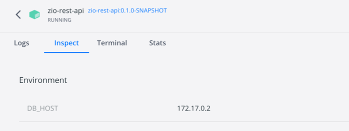
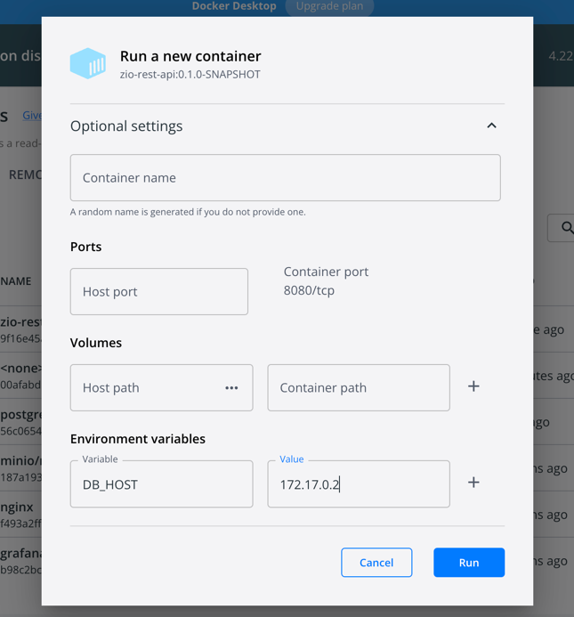

## Running application locally

The application server expects a PostgresQL database to run Flyway migrations. If it can't find one it'll retry forever until successful. This way it doesn't matter what is started first - the application or the database.

#### Database server

Run the local development database with docker. Replace values for `POSTGRES_DB` and `POSTGRES_PASSWORD` according to your settings.
```bash
docker run --name devdb -p 5432:5432 -e POSTGRES_DB=items -e POSTGRES_PASSWORD=12345 -d postgres
```

Connect with `psql`:
```bash
psql -h localhost -U postgres -d items
```

Connect with docker:
```bash
docker exec -it devdb psql -U postgres -d items
```

#### Application server

To run the application locally:
```bash
sbt run
```

After you run the application Flyway will run the migrations.

By default the server is started at `http://localhost:8080`. Expects the database at `localhost:5432` with database name `items` and user/password `postgres/12345`.

You can override the defaults with the following environment variables:

- API_HOST
- API_PORT
- DB_HOST
- DB_PORT
- DB_NAME
- DB_USER
- DB_PASSWORD

## Testing

Run unit tests: 
```
sbt test
```

Run integration tests:
```
sbt it:test
```

The integration tests are using [testcontainers](https://www.testcontainers.org/) to run dockerized PostgrSQL instance and Flyway to apply schema evolutions before running the tests.

## Calling the endpoints

Add new Item:

```bash
curl --request POST \
  --url http://localhost:8080/items \
  --header 'content-type: application/json' \
  --data '{
	"name":"BigMac",
	"price": 10.0
}'
```

Get all Items:

```bash
curl --request GET \
  --url http://localhost:8080/items
```

Get single Item:

```bash
curl --request GET \
  --url http://localhost:8080/items/1
```

Update Item:

```bash
curl --request PUT \
  --url http://localhost:8080/items/1 \
  --header 'content-type: application/json' \
  --data '{
	"name":"BigKing",
	"price": 12.0
}'
```

Detele Item:

```bash
curl --request DELETE \
  --url http://localhost:8080/items/1
```

## Database schema evolution

Schema evolution is done using Flyway.

To add more evolutions add the new scripts to `resources/db/migration`.

Read more about Flyway [here](https://flywaydb.org/documentation/).

## Creating a docker image

This project is configured with [sbt-native-packager](https://www.scala-sbt.org/sbt-native-packager/). To publish a docker image to your local docker repository run:
```
sbt docker:publishLocal
```
This will create an image with name `zio-rest-api:<version>`.

## How to trigger postgress container (devdb) from zio-rest-api container
```
docker network ls
docker network inspect bridge
```

```json lines
{
  "Name": "devdb",
  "EndpointID": "cd1e3da5162e73fc52d81150aa139f60d7493659cb9dfbfab8d56e443018b555",
  "MacAddress": "02:42:ac:11:00:02",
  "IPv4Address": "172.17.0.2/16",
  "IPv6Address": ""
}
```


